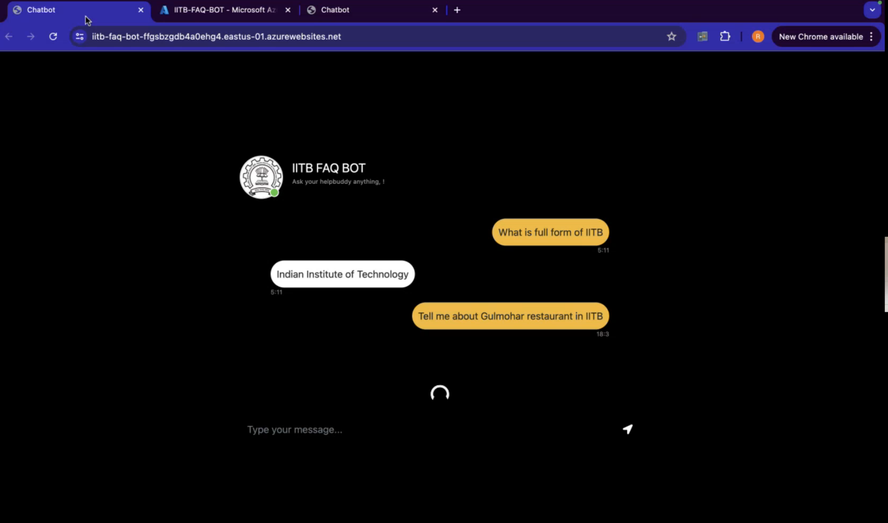
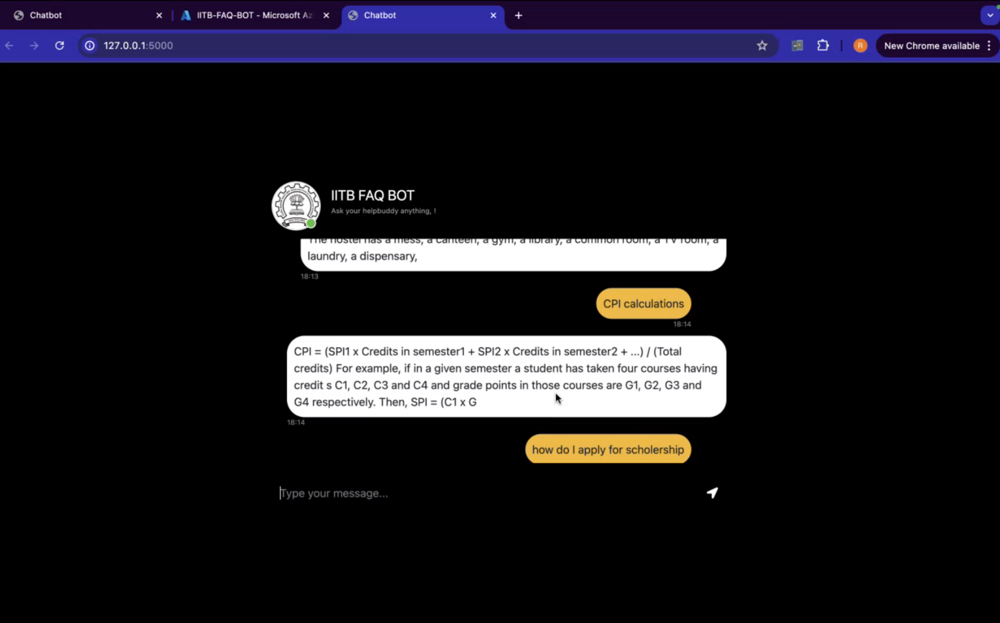

# IITB FAQ Bot

This repository contains the IITB FAQ Bot project, designed to assist users in retrieving precise and concise answers from a preprocessed dataset of FAQs using a robust AI-powered backend.

---

## Features
- **AI-Powered Response System**: Employs LangChain, HuggingFace models, and FAISS for efficient retrieval and accurate question answering.
- **Interactive Web Interface**: Built using Flask, allowing users to interact with the bot seamlessly.
- **Customizable Pipeline**: Supports easy integration of additional datasets for tailored FAQ retrieval.
- **PDF Parsing**: Automates the ingestion and parsing of PDF files into a usable dataset.

---

## Methodology

### 1. **Backend Architecture**
- **PDF Data Loading**: 
  - Utilizes a custom class (`PyPDFDirectoryLoader`) to read and parse the dataset from PDF files.
  - Processes text into chunks using `RecursiveCharacterTextSplitter` to optimize for retrieval.
- **Embedding and Retrieval**: 
  - Converts text into vector embeddings using the HuggingFace `BAAI/bge-small-en-v1.5` model.
  - Stores and retrieves embeddings efficiently using FAISS.
- **Language Model for QA**: 
  - Employs `Mistral-7B-v0.1` LLM for generating accurate and context-aware responses.
  - Uses a custom prompt template to maintain precision and avoid hallucinations.

### 2. **Frontend**
- Built with Flask, featuring:
  - A simple homepage (`index.html`) to input queries.
  - Integration with the backend for real-time responses.

### 3. **Interaction Workflow**
1. User inputs a query on the web interface.
2. The backend processes the query:
   - Retrieves relevant chunks of context from the dataset.
   - Passes the context and query to the language model.
3. The response is sent back to the user through the Flask app.

---

## Installation

### Prerequisites
- Python 3.8 or higher
- Necessary dependencies (`pip install -r requirements.txt`)

### Steps
1. Clone the repository:
   - git clone https://github.com/rajdip-i/IITB-FAQ-BOT.git
   - cd IITB-FAQ-BOT
2. Install dependencies:
   - pip install -r requirements.txt

3. Add your HuggingFace API key in the .env file:
   - HUGGINGFACEHUB_API_TOKEN=YOUR_API_KEY

4. Run the Flask app:
   - python app.py

---
## Demo Screenshots

